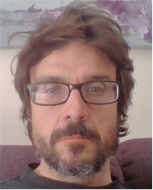

# Mis sesiones de natación en Helios

Documentación de las sesiones de natación realizadas en el C.N. Helios. Gracias al club, y en particular a su director técnico David Boudet, por confiar en mí.

## ¿Quién soy?

Carlos Rodríguez Jaso
 

* Carrera como nadador:
  - Nadador activo durante las temporadas 1978-79 a 1997-1998
  - Clubes: E.M. Olivar hasta 1980, C.N. Helios desde 1980
  - Mejores pruebas: 100 y 200 Mariposa, 400 estilos
  - Principales logros deportivos:
     - Medallista en campeonatos de España por grupos de edad y absoluto
     - Internacional por España en categorías inferiores y absoluta: Campeonato de Europa Junior, Juegos del Mediterráneo,...
     - Mejor deportista de C.N. Helios en 1988
* Experinecia como técnico:
   - Técnico de las categorías inferiores de P.San Agustín y C.N. Helios
   - Colaborador con la federación aragonesa en las sesiones de tecnificación de categorías inferiores.
   
   
## Licencia
  
[Creative Commons Attribution-ShareAlike 4.0 International License](http://creativecommons.org/licenses/by-sa/4.0/)

